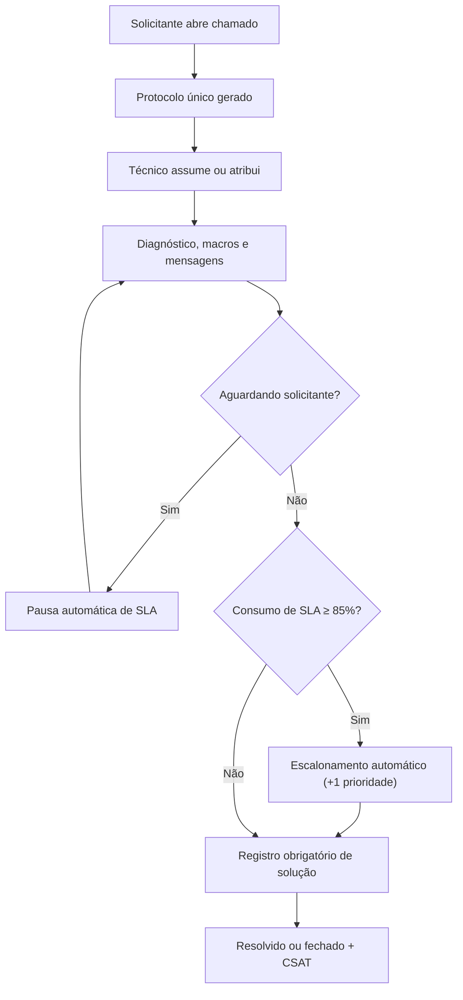
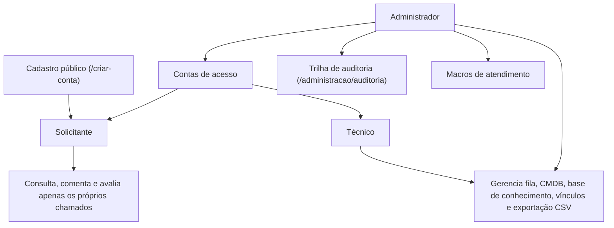
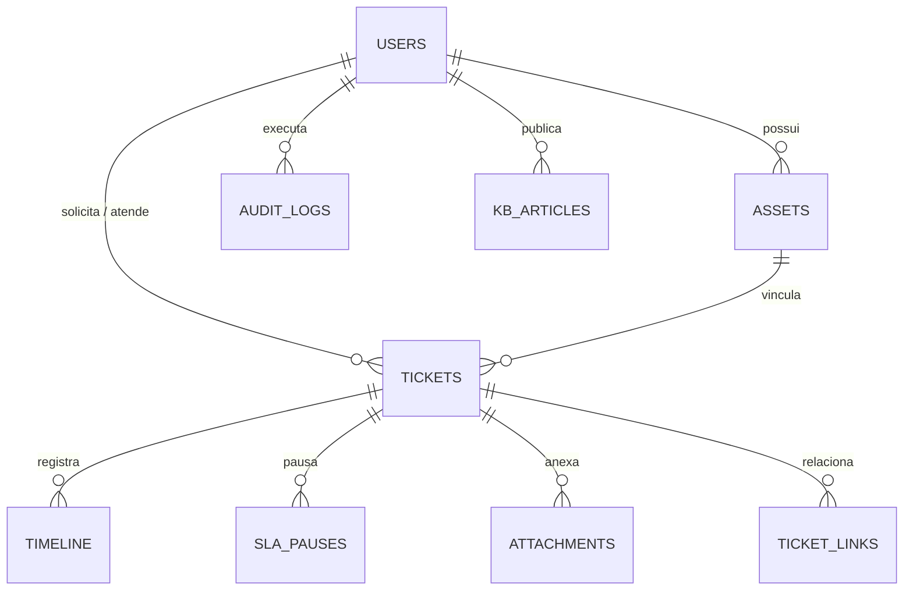
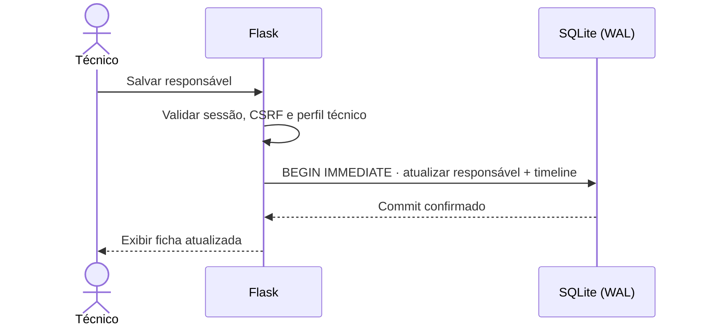

# Diagramas do SXS TI

## Abertura, SLA e atendimento

```mermaid
flowchart TD
    A["Solicitante abre chamado"] --> B["Protocolo único gerado"]
    B --> C["Técnico assume ou atribui"]
    C --> D["Diagnóstico, macros e mensagens"]
    D --> E{"Aguardando solicitante?"}
    E -->|Sim| F["Pausa automática de SLA"]
    F --> D
    E -->|Não| G{"Consumo de SLA ≥ 85%?"}
    G -->|Sim| H["Escalonamento automático (+1 prioridade)"]
    H --> I["Registro obrigatório de solução"]
    G -->|Não| I
    I --> J["Resolvido ou fechado + CSAT"]
```

## Perfis, permissões e auditoria

```mermaid
flowchart TD
    Cadastro["Cadastro público (/criar-conta)"] --> S["Solicitante"]
    Admin["Administrador"] --> Contas["Contas de acesso"]
    Admin --> Auditoria["Trilha de auditoria (/administracao/auditoria)"]
    Admin --> Macros["Macros de atendimento"]
    Contas --> S
    Contas --> T["Técnico"]
    S --> Proprios["Consulta, comenta e avalia apenas os próprios chamados"]
    T --> Fila["Gerencia fila, CMDB, base de conhecimento, vínculos e exportação CSV"]
    Admin --> Fila
```

## Modelo relacional completo

```mermaid
erDiagram
    USERS ||--o{ TICKETS : "solicita / atende"
    USERS ||--o{ ASSETS : "possui"
    USERS ||--o{ AUDIT_LOGS : "executa"
    USERS ||--o{ KB_ARTICLES : "publica"
    ASSETS ||--o{ TICKETS : "vincula"
    TICKETS ||--o{ TIMELINE : "registra"
    TICKETS ||--o{ SLA_PAUSES : "pausa"
    TICKETS ||--o{ ATTACHMENTS : "anexa"
    TICKETS ||--o{ TICKET_LINKS : "relaciona"
```

## Atribuição com histórico transacional

```mermaid
sequenceDiagram
    actor T as Técnico
    participant F as Flask
    participant D as SQLite (WAL)
    T->>F: Salvar responsável
    F->>F: Validar sessão, CSRF e perfil técnico
    F->>D: BEGIN IMMEDIATE · atualizar responsável + timeline
    D-->>F: Commit confirmado
    F-->>T: Exibir ficha atualizada
```
